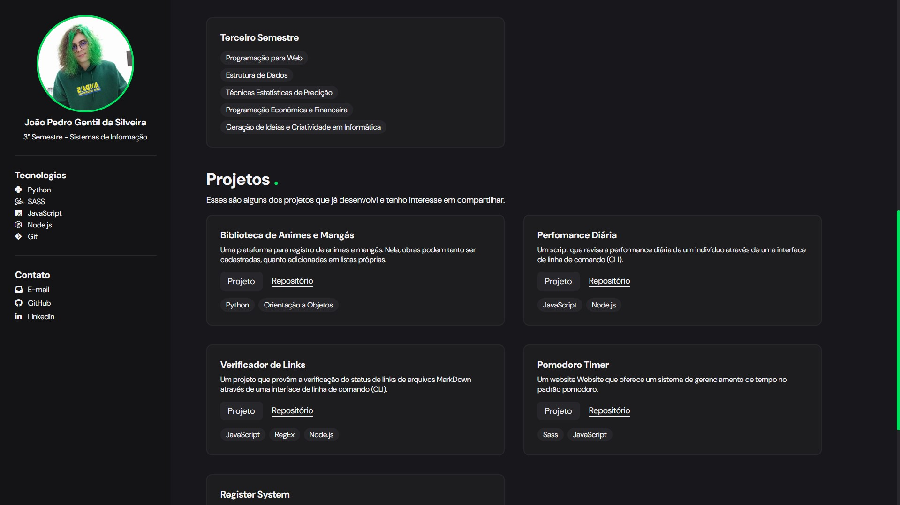

# Pagina Pessoal

## Sobre
Página pessoal feita para a disciplina de Programação Web do curso de Sistemas de Informação da Universidade Federal de Santa Catarina (UFSC). Teve o propósito de construir uma interface responsiva que contivesse informações acerca de mim mesmo, as disciplinas vistas no curso e projetos quaisquer já realizados.

Em finalidade técnica, serve para exercitar conceitos de HTML e CSS, bem como colocar em prática tais tecnologias. Complementar a isso, optou-se usar de Sass, um pré-processador de CSS que oferece uma série de funcionalidades diferenciadas para linguagem de estilos, a fim de ir além na tarefa.

## Tecnologias
- HTML5;
- SCSS.

## Links
- <a href="https://joapsilv-pagina-pessoal.netlify.app" target="_blank">Site</a>.
